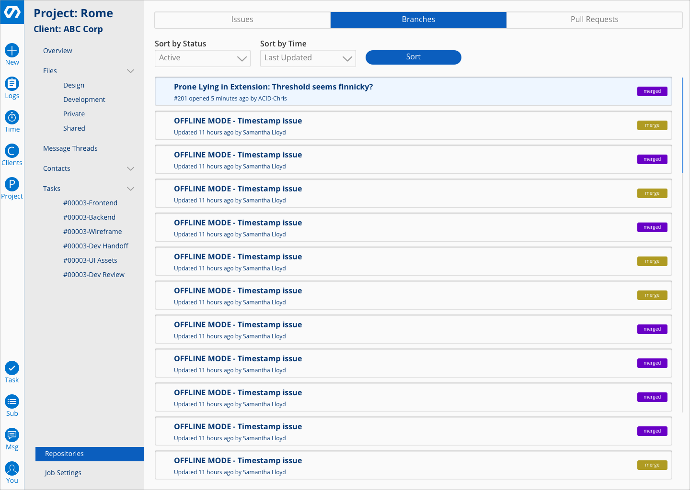
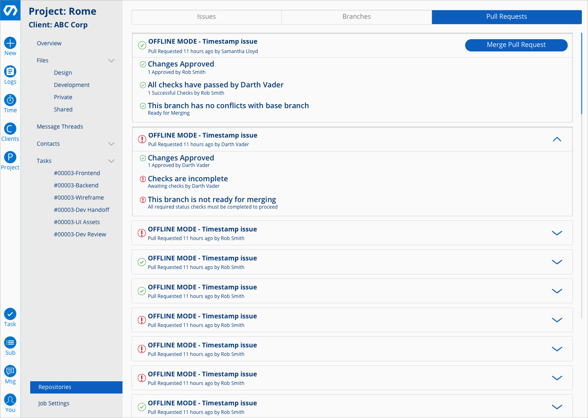
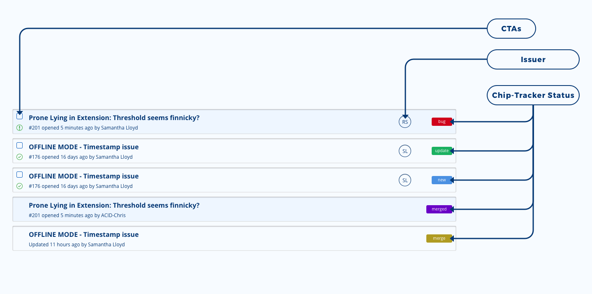
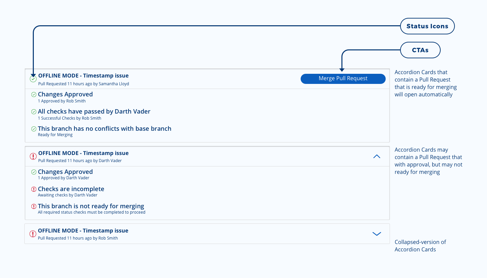

**Relae** (NDA) is an all-in-one project management internal solution that integrates with most tool in the market such as Jira and Figma.

---

## Project Summary

1. User Need: Provide a way for Project Managers to view multiple projects statuses in one place.
2. Business Goal: Provide a digital tracker for Project Manager to see everything that they manage in one place.
3. Challege: How might we empower non-technical Project Manager to manage their team?

---

## My role

> Lead Product Designer

| Products I worked on   | Function                 | User              |
| ---------------------- | ------------------------ | ----------------- |
| Project Dashboard      | Manage all projects      | Project Manager   |
| Git Dashboard          | Sync status in Github    | Developer         |
| Figma Dashboard        | Sync status in Figma     | Designer          |
| Pull Request Dashboard | Sync PR status in Github | Quality Assurance |
| Issues Tracker         | Sync Issues in Github    | UAT Tester        |

## Strategy

My idea is to split each input from each software as 1 page dashboard and it eventually became a multipage dashboard that the project manager able to navigate in one site instead of logging into different sites to see each person statuses.

### 1. Input-Output

Since this project involves multiple pipeline that I am not familiar with, I decided to simplify it by thinking of input-output. I did a VOE with all stakeholders and get them to list me all of the input that they need to let the Project Manager know and design the output in the product.

### 2. Minimal Enough

From the stakeholders, I made them list me their top three information that they usually need to report from their tool to the project manager. This allows the product to pass on just enough minimal information without overloading the project manager.

### 3. Action Prioritization

Because there's only some action that the project manager needed from each tool, I only provided minimal action for their CTAs, not to replicate for example, github. Just enough place where they can see the project status and also do actions that they mostly do in github and other tools.

## Metric Result

- 80% team productivity improved
- 75% improved project deadline delivery
- 20% decrease in team's miscommunication
