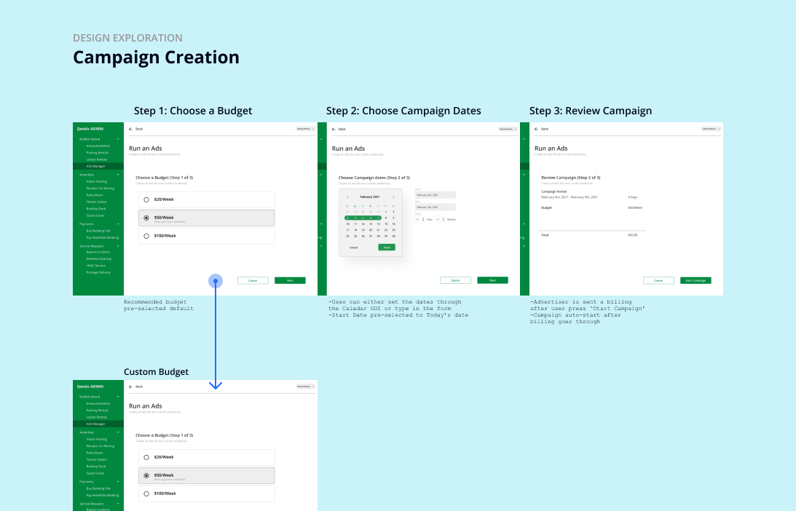
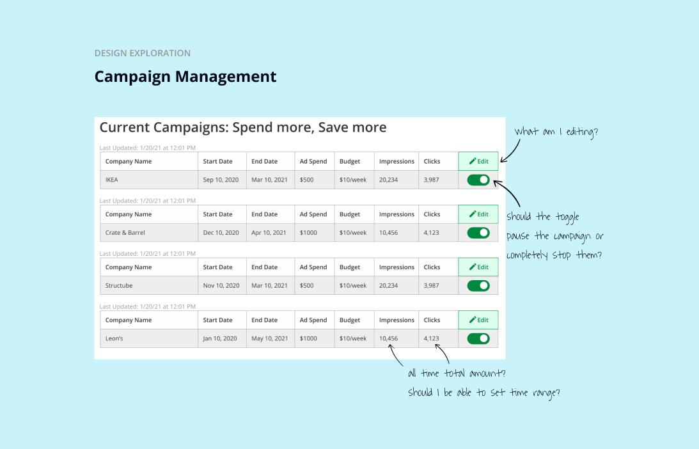

**Project Jupiter** (NDA) is a product that manages a microcosm of condo community for community manager and residents.

---

## Project Summary

1. User Need: A God-like view of everything needed to manage a condo community.
2. Business Goal: Create connection between community manager and residents.
3. Challege: How might we allow community managers to provide a best-in class service for residents?

---

## My role

> UX Consultant

| Products I worked on | Function                               | User              |
| -------------------- | -------------------------------------- | ----------------- |
| Ads Manager          | Manage Ads for condo community         | Community Manager |
| Community Dashboard  | Manage dashboards for all stakeholders | All stakeholders  |
| Delivery Manager     | Manage delivery packages               | All stakeholders  |

## Strategy

My solution needs to be streamlined, such that it is easy to adopt for people who are not used to doing their work digitally. From research insights, I formed 3 guiding principles that guided design decisions.

### 1. Least amount of presses

We try to limit most flows to require less than 10 presses to complete the major steps. This allow the repeat users and power users who are familiar with our flows to have very little tension when they are repeating the same flows that they are very familiar with. For most major flows, we did extensive user research and validation by going to gemba and doing ethnographical research right next to them.

### 2. Establish Trustworthiness

Most of our userbase are people who might be first time adopter of digital process. As the first touchpoint of digital experience, establishing trustworthiness is crucial to turn them into repeat users and eventually power users. We do this by being visual with every little system statuses, enough to be clear, but not too much to be too overwhelming. Notifications is a good example where we design the experience very carefully.

### 3. Anticipate Failure

As Enterprise product on multiple platforms, we design our product with the expectation that things can and should fail on each step of the user experience. Error state are designed from the micro level at component level up to the macro level of the whole user journey. So whenever there is something unexpected happens(they usually do even during testing and validation), there is always a backup that prevent the user from getting frustrated when using our product.

## Metric Result

- 80% client approval out of 100k users within 3 months
- 75% first time user becomes repeat user
- 20% repeat user becomes power user who champions our products within their company
