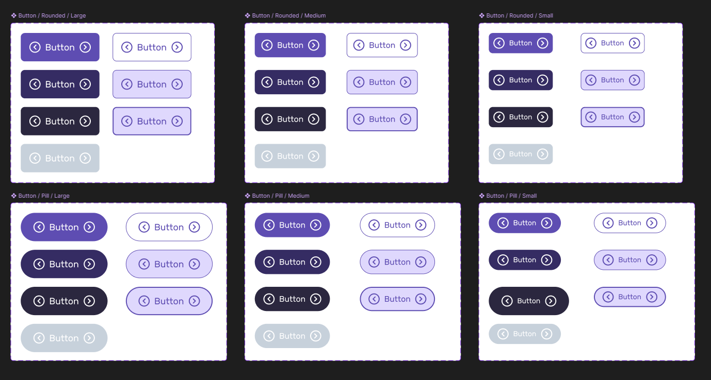

Infinity Design System (NDA name) utilizes the most up-to-date MCP Server and AI models in VS Code to increase adoption and ease of use for all stakeholders from designers, developers, product manager, and marketing. This allows the closest we have from design in figma to production ready code. I am responsible in setting up responsive components, variables, and code connect in Figma, ensuring that all naming structure and code syntax is scalable to development using MCP Server. The dream is to lead the rest of product by design through this design system.

---

## Scalable System

I ensure that the naming structure of all components and variables are scalable, so even developers are using the same name in their CSS style tokens. We use atomic names and split the naming levels into three(3): Global, Semantic, Component. Global is for all Foundation level tokens such as color and typography. Semantic is for things shared by more than one component, such as background-color. Component is for tokens that are unique and specific to one component and they are not repeatable.

## Responsive component

All component is responsive that allow designer to quickly make prototype to show clients to validate the design and allow hand-off as reusable component via Github Copilot in VS Code. As we are using MCP Server and utilizing LLMs through Github Copilot in VS Code, we ensured that all text-based UI element has a name that will make the LLMs understand better, such as ensuring that each Figma layers are properly named and has Dev Mode annotation separated by their types such as for interactions and accessibility. We found that LLM-based model understand text-based input better.

## Consistency

To ensure consistent quality, we utilize the text-based prompt of LLMs. For example, we have standard text-based prompt to create the react prototype for non-developers to create a prototype using the least possible prompts through MCP that ensures WCAG compliant and that it is creating reusable components that we can ship to developers that allow them to turn it into production ready code.

---

## Challenges

Because it is a new technology, we had to spend more time with experimentation and validate that it works for the end-to-end pipeline that we are creating, involving multiple stakeholders who are not technical or know much about development. Another challenge is the unknown and doing the whole process without a clear path that it will work.
